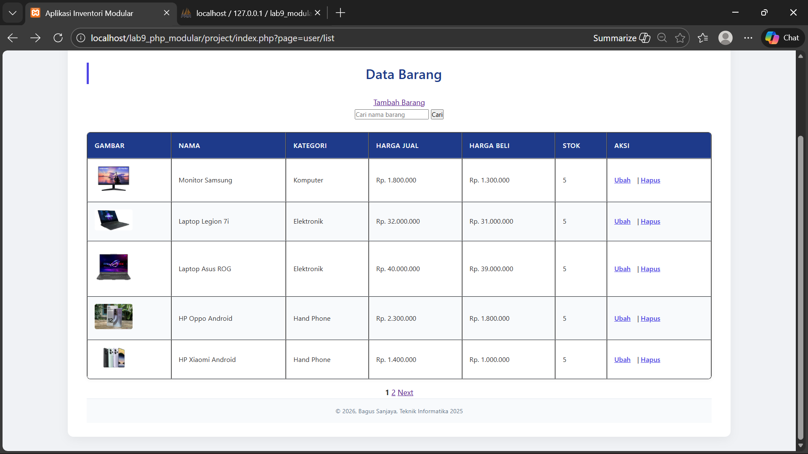
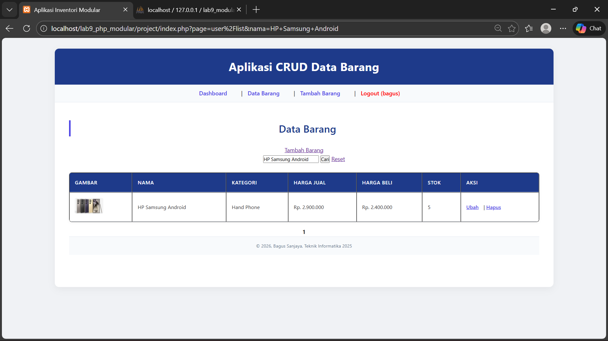
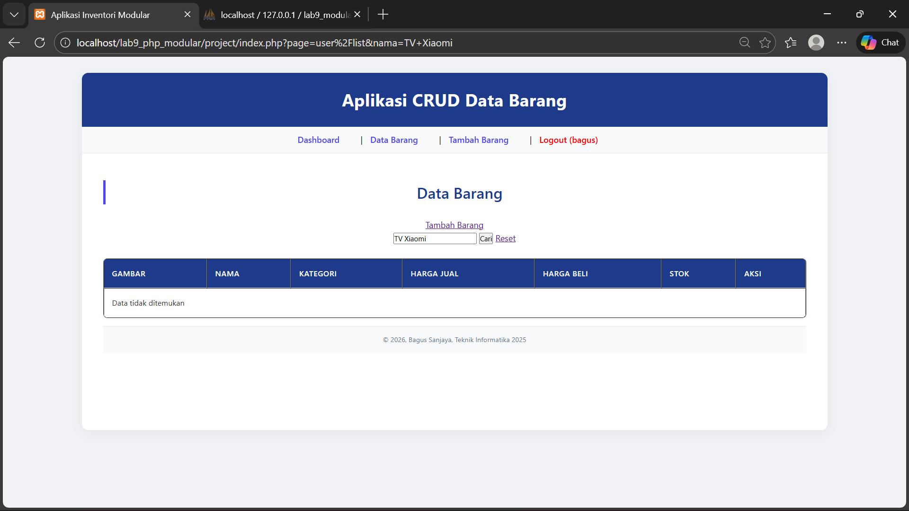

# Praktikum13_14

# Nama: Bagus Sanjaya

# Kelas: TI.24.A.5

# NIM: 312410505

# Modul Data Barang (PHP & MySQL)

Project ini merupakan modul **manajemen data barang** berbasis **PHP dan MySQL** dengan arsitektur modular.  
Fitur utama yang disediakan meliputi **menampilkan data barang**, **pencarian**, **pagination**, serta **aksi CRUD** (Create, Read, Update, Delete).

## Struktur Data

Tabel utama yang digunakan adalah `data_barang` dengan struktur sebagai berikut:

| Field        | Keterangan |
|-------------|------------|
| id_barang   | Primary Key (AUTO_INCREMENT) |
| kategori    | Kategori barang |
| nama        | Nama barang |
| gambar      | Path file gambar |
| harga_beli  | Harga beli barang |
| harga_jual  | Harga jual barang |
| stok        | Jumlah stok |

## Keamanan Akses

Sistem dilengkapi dengan **validasi session login**, sehingga hanya pengguna yang sudah login yang dapat mengakses halaman data barang.

```php
if (!isset($_SESSION['logged_in']) || !$_SESSION['logged_in']) {
    echo "Akses ditolak";
    return;
}
````

## Fitur Pencarian Data

Pencarian data dilakukan berdasarkan **nama barang** menggunakan metode `GET` dan klausa `LIKE` pada query MySQL.

```sql
WHERE nama LIKE 'keyword%'
```

Fitur ini memungkinkan pengguna mencari data dengan awalan nama tertentu tanpa harus menampilkan seluruh data.

## Pagination (Pembagian Halaman)

Pagination digunakan untuk membatasi jumlah data yang ditampilkan per halaman agar tampilan lebih rapi dan efisien.

### Prinsip Pagination:

* Menggunakan `LIMIT` dan `OFFSET`
* Menentukan jumlah data per halaman (`$per_page`)
* Menghitung total data menggunakan `COUNT(*)`

```php
$offset = ($page_num - 1) * $per_page;
```

Pagination juga mendukung:

* Tombol **Previous**
* Tombol **Next**
* Penomoran halaman
* Tetap mempertahankan parameter pencarian

## Pengelolaan Gambar

Sistem mendukung penampilan gambar barang dari folder:

```
assets/gambar/
```

Jika path gambar di database belum mengandung folder tersebut, sistem akan menyesuaikannya secara otomatis.

## Aksi Data (CRUD)

Setiap data barang memiliki aksi:

* **Tambah** data
* **Ubah** data
* **Hapus** data (dengan konfirmasi)

```html
<a href="index.php?page=user/edit&id=...">Ubah</a>
<a href="index.php?page=user/delete&id=..." onclick="return confirm('Yakin hapus?')">Hapus</a>
```


## Teknologi yang Digunakan

* PHP (Native / Modular)
* MySQL
* HTML & CSS
* Session PHP


## Catatan

* Pastikan koneksi database sudah dimuat (`config/database.php`)
* Folder `assets/gambar/` harus tersedia
* Project dijalankan melalui web server (XAMPP / Laragon)


## Tujuan Pembelajaran

Project ini dibuat untuk memenuhi **praktikum pemrograman web PHP**, khususnya:

* Penerapan query MySQL
* Implementasi pencarian data
* Pagination menggunakan LIMIT & OFFSET
* Pengelolaan session
* Struktur modular PHP

## Preview






